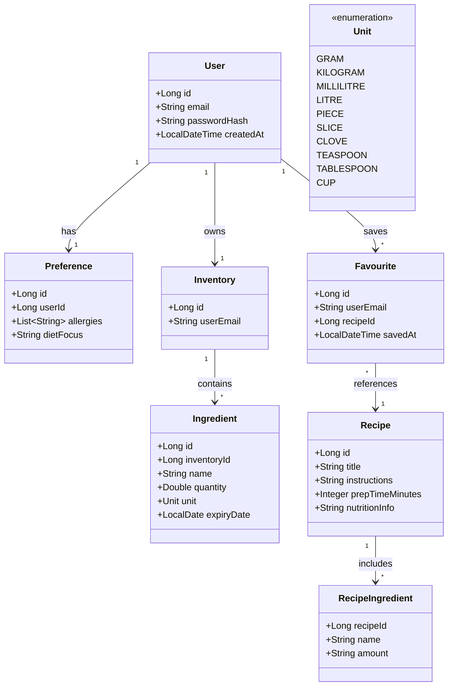
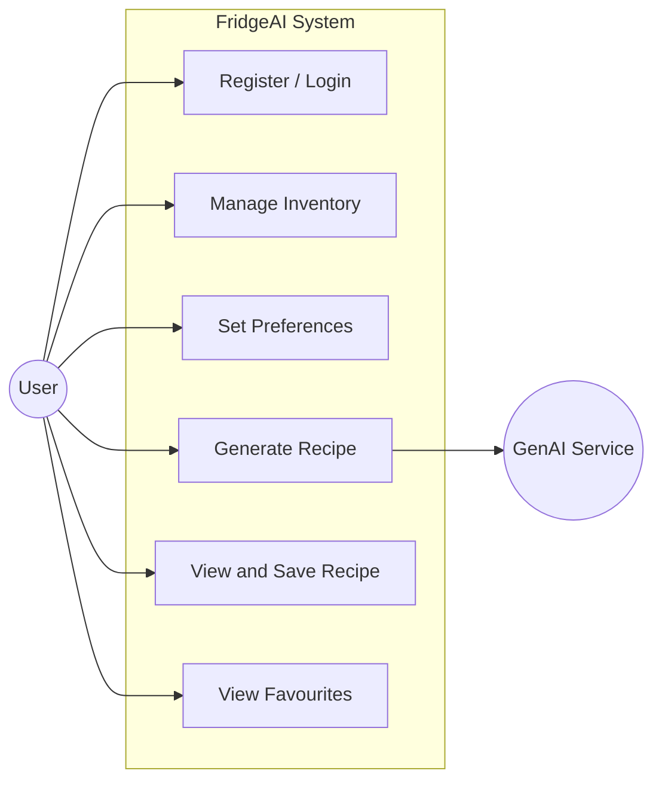
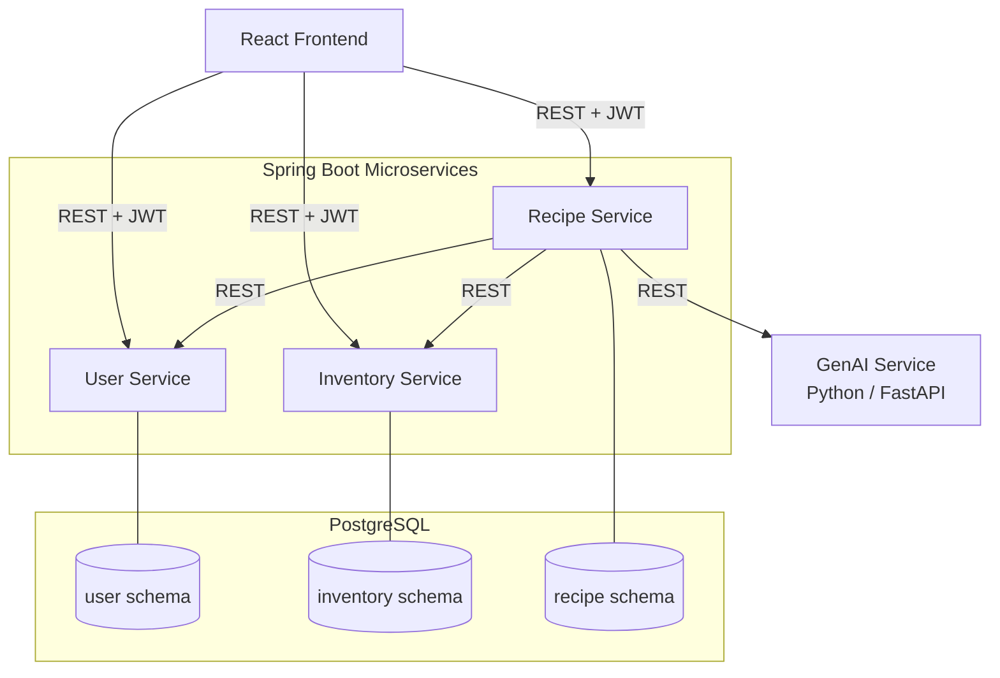

# Initial System Structure

## Tech Stack Overview

| Layer | Technology |
|---|---|
| Client | React |
| Server | Spring Boot (Java) — 3 microservices |
| GenAI Service | Python + FastAPI (`openai` SDK, OpenAI-compatible: Logos cloud / local Ollama) |
| Database | PostgreSQL |
| Auth | JWT issued by User Service, validated by other services |
| Communication | REST between all services |

---

## Services Breakdown

### User Service
Handles registration, login, and user preferences (allergies, preferences). Issues a JWT on successful login that is used by all other services to authenticate requests.

### Inventory Service
Manages the user's ingredient inventory — adding, updating, and removing ingredients along with quantities, units, and expiry dates. Exposes an endpoint for the Recipe Service to fetch a user's current ingredients.

### Recipe Service
The core service. Receives a recipe generation request from the client, fetches the user's ingredients from the Inventory Service and preferences from the User Service, then calls the GenAI Service to generate a recipe. Also handles saving and retrieving favourite recipes.

### GenAI Service (Python / FastAPI)
An independent Python microservice that receives the user's ingredients (with expiry dates) and preferences, builds a structured prompt, and returns a generated recipe as JSON via an OpenAI-compatible LLM (Logos cloud in production, local Ollama in dev).

---

## Analysis Object Model

---

## Use Case Diagram

---

## Top-Level Architecture (Component Diagram)

